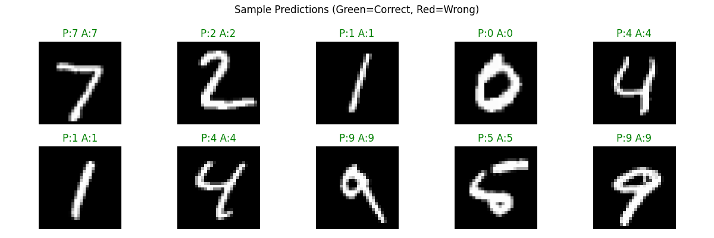
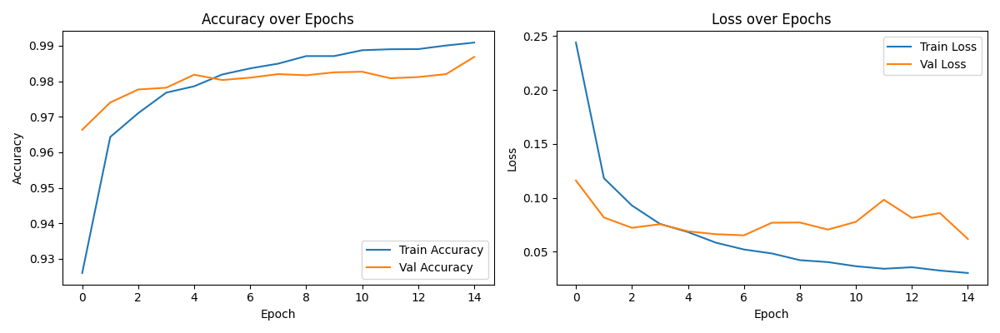

# Handwritten Digit Recognizer 

An ANN trained on the MNIST dataset achieving **98% test accuracy**. Includes a real-time drawing canvas to predict handwritten digits instantly.

# Demo




## Setup
```bash
pip install tensorflow numpy matplotlib pillow
python handwrittenDigitRecog.py
```

# How It Works
- ANN with 3 Dense layers (512 → 256 → 128 → 10)
- Dropout regularization to prevent overfitting
- Trained for 15 epochs with Adam optimizer
- Draw any digit on the canvas → instant prediction + confidence score

# Results
 Metric  Value 
 Test Accuracy -> 98.05% 
 Dataset -> MNIST (70,000 images) 
 Epochs -> 15 

## Author
**Vanshika Nautiyal** • [GitHub](https://github.com/VanshikaN10)
